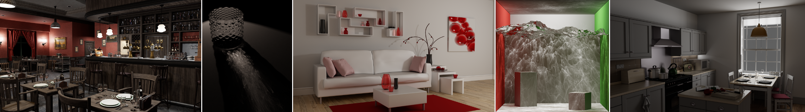

# Accelerated Photon Mapping for Hardware-based Ray Tracing (using Falcor 5.2)

A Progressive Photon Mapper that uses the ray tracing hardware for distribution and collection of photons. Our Photon Mapper uses NVIDIA's [Falcor 5.2](https://developer.nvidia.com/falcor) framework. More details on how the Progressive Photon Mapper works can be found in our paper published in the Journal of Computer Graphic Techniques [here](https://jcgt.org/published/0012/01/01/).

## Prerequisites
- Windows 10 version 20H2 (October 2020 Update) or newer, OS build revision .789 or newer
- A GPU which supports DirectX Raytracing, such as the NVIDIA Titan V or GeForce RTX
- NVIDIA driver 466.11 or newer

Additionally needed for the precompiled version:
- [Microsoft Visual C++ Redistributable x64](https://aka.ms/vs/17/release/vc_redist.x64.exe) ( Most windows programs need these, so they are probably already installed. If the applications do not start, try installing these.)

Additionally needed for building the code:
- Visual Studio 2019 or 2022
- [Windows 10 SDK (10.0.19041.0) for Windows 10, version 2004](https://developer.microsoft.com/en-us/windows/downloads/windows-10-sdk/)

## Setup
This section can be skipped if using the precompiled files (Release Build). 

The setup is identical to Falcor 5.2. For the sake of simplicity, we only describe how to set up Falcor with Visual Studio 2019 and 2022. For other build options and additional information, see the `Building Falcor` section [here](./FALCOR_README.md#Building%20Falcor).

### Visual Studio
You can set up a native Visual Studio solution by running `setup_vs2019.bat` (or `setup_vs2022.bat`, same process) after **cloning** this repository. The solution files are written to `build/windows-vs2019-d3d12` and the binary output is located in `build/windows-vs2019-d3d12/bin`.

Alternatively, you can use [CMake](https://cmake.org). Run the `setup.bat` and then use the *CMake Presets* `windows-vs2019-d3d12` or `windows-vs2022-d3d12` with the command `cmake --preset <preset name>`. You can find more information for generating the build files using *CMake* under the `Building Falcor/Configure Presets` section [here](./FALCOR_README.md#Configure%20Presets).

Build in Visual Studio with `Build -> Build Solution` for the correct build order. Otherwise, multiple builds may be necessary.

## Loading in Falcor Scripts and Scenes
- Start the renderer Mogwai:
	- Build Solution with `Build -> Build Solution` in `Release` or `Debug` configuration. This step is skipped for the precompiled version.
	- Run `RunMogwai.bat`, which loads in the RTPM render pass and the caustic glass scene. 
		- Alternatively, start Mogwai via Visual Studio or from `FalcorData/Mogwai.exe` for the precompiled version. In this case, a photon map script and scene need to be loaded separately.
- Load a render pass:
	- Load a render pass in Mogwai under `File -> Load Script`. You can find the photon map scripts in the `PhotonMapPasses` folder.
- Load a scene:
	- Load a scene in Mogwai under `File -> Load Scene`. 
	- Most scenes from the paper can be found in the `Scenes` folder. Load in a `.pyscene` file to get the same results as in the paper.
		- For information about settings used in the paper, see `Scenes\SceneSettings.csv`.
		- The Amazon Lumberyard Bistro scene needs to be downloaded separately ([here](https://developer.nvidia.com/orca/amazon-lumberyard-bistro)). Our test scenes are marked with an `RTPM` prefix. For more information see `Scenes/Bistro_v5_2/BISTRO_README.txt`.
	- All Falcor-supported scenes with emissive lights and analytic spot/point lights are supported. Environment maps are currently not supported.

## Examples
- Example renders can be found under the `ExampleImages` folder.
- A demo video showing the photon mapper and some functions can be found under: [https://youtu.be/PVgip3L8q-I](https://youtu.be/PVgip3L8q-I)

## Render Passes
| Graph | Description |
|---|---|
|VBufferPM | A modified V-Buffer that traces the path until it hits a diffuse surface. |
|RTPhotonMapper | The ray tracing hardware-based progressive photon mapper. Photons are distributed through the scene with ray tracing. An acceleration structure is built with the distributed photons that are then collected with an infinite small ray. The user controls the number of photons and needs to ensure that the photon buffer is big enough. You can access additional information for each UI variable by hovering over the question mark on the right side of the UI variable. 
|HashPPM | An alternative implementation of the RTPhotonMapper using a hash grid for collection. The photons are still distributed with ray tracing but are now stored in a hash map. Like with the RTPhotonMapper, the user has to ensure that the photon buffer is big enough. For additional information, hover over the question mark on the right side of the UI variable.
|StochHashPPM | An alternative implementation of the RTPhotonMapper using a stochastic hash grid for collection. Photons are distributed via a ray tracing shader and are stored in a hash grid. On collision, the photon is randomly overwritten. For additional information, hover over the question mark on the right side of the UI variable.

## Source Code
We recommend Visual Studio 2019 or 2022 for navigating the source code. You can find the code for our Photon Mappers in the respective folder under `Source/RenderPasses`.
For more information about how to use Falcor, see the [getting started](./docs/getting-started.md) or the [full documentation index](./docs/index.md)
